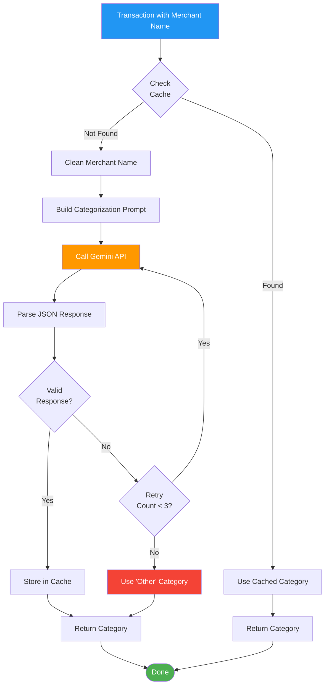
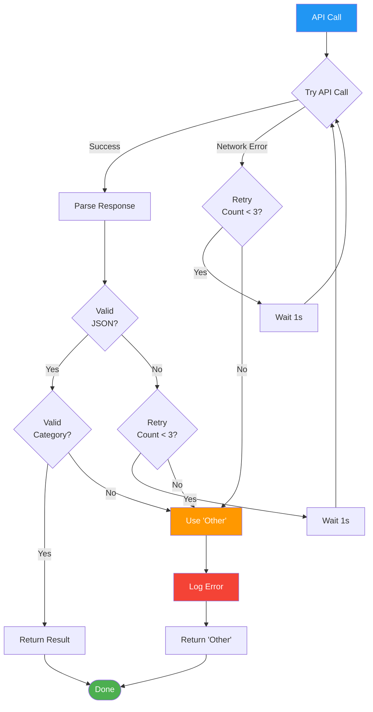

# Gemini API Integration

## Table of Contents

- [Overview](#overview)
- [API Setup](#api-setup)
- [Categorization Architecture](#categorization-architecture)
- [API Request Flow](#api-request-flow)
- [Prompt Engineering](#prompt-engineering)
- [Request/Response Examples](#requestresponse-examples)
- [Caching Strategy](#caching-strategy)
- [Error Handling](#error-handling)
- [Rate Limiting](#rate-limiting)
- [Cost Optimization](#cost-optimization)
- [Related Documentation](#related-documentation)

## Overview

Vault uses Google's **Gemini API** to automatically categorize transactions based on merchant names. This approach provides:

- High accuracy for merchant identification
- Natural language understanding of transaction descriptions
- Minimal manual rule creation
- Continuous improvement as models improve

**Key Principle:** Only merchant names are sent to the API. Transaction amounts, dates, and other sensitive data remain local.

## API Setup

### Get an API Key

1. Visit [Google AI Studio](https://ai.google.dev/)
2. Click "Get API Key"
3. Create a new project or select existing one
4. Generate API key
5. Copy the key

### Configure Environment

Create a `.env.local` file in the project root:

```bash
GEMINI_API_KEY=your_api_key_here
```

**Security:**
- Never commit `.env.local` to version control (already in `.gitignore`)
- Treat API keys like passwords
- Rotate keys every 90 days
- Use API key restrictions in Google Cloud Console

### Install SDK

```bash
npm install @google/generative-ai
```

### Initialize in Code

```typescript
// src/lib/gemini-client.ts
import { GoogleGenerativeAI } from '@google/generative-ai';

const genAI = new GoogleGenerativeAI(process.env.GEMINI_API_KEY!);

export const model = genAI.getGenerativeModel({
  model: 'gemini-1.5-flash', // Fast and cost-effective
});
```

## Categorization Architecture



## API Request Flow

### Categorization Function

```typescript
// src/lib/categorization/categorize.ts
import { model } from '@/lib/gemini-client';
import { getCachedCategory, cacheCategory } from '@/lib/db/merchant-cache';

export interface CategorizationResult {
  category: 'Dining' | 'Groceries' | 'Gas' | 'Travel' | 'Other';
  transactionType: 'purchase' | 'transfer' | 'income';
  confidence: number;
}

export async function categorizeTransaction(
  merchantName: string
): Promise<CategorizationResult> {
  // 1. Normalize merchant name
  const normalized = normalizeMerchant(merchantName);

  // 2. Check cache first
  const cached = await getCachedCategory(normalized);
  if (cached) {
    return {
      category: cached.category,
      transactionType: cached.transaction_type,
      confidence: 1.0 // Cached results are trusted
    };
  }

  // 3. Call Gemini API
  const prompt = buildCategorizationPrompt(normalized);

  try {
    const result = await model.generateContent(prompt);
    const response = result.response;
    const text = response.text();

    // 4. Parse JSON response
    const parsed = JSON.parse(text);

    // 5. Validate response
    if (!isValidCategory(parsed.category)) {
      throw new Error(`Invalid category: ${parsed.category}`);
    }

    // 6. Cache result
    await cacheCategory(normalized, parsed.category, parsed.transactionType);

    // 7. Return result
    return {
      category: parsed.category,
      transactionType: parsed.transactionType,
      confidence: parsed.confidence || 0.9
    };
  } catch (error) {
    console.error('Categorization error:', error);

    // Fallback to 'Other'
    return {
      category: 'Other',
      transactionType: 'purchase',
      confidence: 0.0
    };
  }
}
```

### Merchant Name Normalization

```typescript
function normalizeMerchant(merchant: string): string {
  return merchant
    .toUpperCase()
    .replace(/[^A-Z0-9\s]/g, '') // Remove special characters
    .replace(/\s+/g, ' ')         // Collapse multiple spaces
    .trim()
    .substring(0, 100);           // Limit length
}

// Examples:
// "STARBUCKS #12345" → "STARBUCKS 12345"
// "Shell Oil 57443423232" → "SHELL OIL 57443423232"
// "Whole Foods Market" → "WHOLE FOODS MARKET"
```

## Prompt Engineering

### Categorization Prompt

```typescript
function buildCategorizationPrompt(merchantName: string): string {
  return `Categorize the following merchant transaction.

**Merchant Name:** ${merchantName}

**Categories:**
- Dining: Restaurants, cafes, fast food, bars, coffee shops
- Groceries: Supermarkets (excluding wholesale clubs like Costco which sell groceries but aren't pure grocery stores)
- Gas: Gas stations, fuel
- Travel: Airlines, hotels, car rentals, travel agencies, Airbnb, Uber/Lyft for travel purposes
- Other: Everything else

**Transaction Types:**
- purchase: Standard spending transaction
- transfer: Money movement (Zelle, Venmo, PayPal, bank transfers, ATM)
- income: Deposits, paychecks, refunds, reimbursements

**Instructions:**
1. Analyze the merchant name
2. Determine the most likely category
3. Identify the transaction type
4. Provide a confidence score (0.0 to 1.0)

**Output Format (JSON only, no markdown):**
{
  "category": "Dining",
  "transactionType": "purchase",
  "confidence": 0.95
}

**Examples:**

Merchant: STARBUCKS
→ { "category": "Dining", "transactionType": "purchase", "confidence": 0.99 }

Merchant: WHOLE FOODS MARKET
→ { "category": "Groceries", "transactionType": "purchase", "confidence": 0.98 }

Merchant: SHELL GAS STATION
→ { "category": "Gas", "transactionType": "purchase", "confidence": 0.99 }

Merchant: ZELLE SENT
→ { "category": "Other", "transactionType": "transfer", "confidence": 1.0 }

Merchant: PAYCHECK DEPOSIT
→ { "category": "Other", "transactionType": "income", "confidence": 1.0 }

Now categorize: ${merchantName}`;
}
```

### Prompt Design Principles

1. **Clear Category Definitions** - Provide examples for each category
2. **Structured Output** - Request JSON for easy parsing
3. **Few-Shot Learning** - Include 5-10 examples
4. **Confidence Scoring** - Ask for confidence to detect ambiguous cases
5. **No Markdown** - Request plain JSON (no \`\`\`json wrappers)

## Request/Response Examples

### Example 1: Restaurant

**Request:**
```json
{
  "contents": [{
    "parts": [{
      "text": "Categorize the following merchant transaction.\n\n**Merchant Name:** CHIPOTLE MEXICAN GRILL\n\n..."
    }]
  }]
}
```

**Response:**
```json
{
  "category": "Dining",
  "transactionType": "purchase",
  "confidence": 0.99
}
```

### Example 2: Grocery Store

**Request:**
```json
{
  "contents": [{
    "parts": [{
      "text": "Categorize the following merchant transaction.\n\n**Merchant Name:** TRADER JOES 123\n\n..."
    }]
  }]
}
```

**Response:**
```json
{
  "category": "Groceries",
  "transactionType": "purchase",
  "confidence": 0.98
}
```

### Example 3: Transfer

**Request:**
```json
{
  "contents": [{
    "parts": [{
      "text": "Categorize the following merchant transaction.\n\n**Merchant Name:** VENMO PAYMENT\n\n..."
    }]
  }]
}
```

**Response:**
```json
{
  "category": "Other",
  "transactionType": "transfer",
  "confidence": 1.0
}
```

### Example 4: Ambiguous Merchant

**Request:**
```json
{
  "contents": [{
    "parts": [{
      "text": "Categorize the following merchant transaction.\n\n**Merchant Name:** COSTCO WHOLESALE\n\n..."
    }]
  }]
}
```

**Response:**
```json
{
  "category": "Other",
  "transactionType": "purchase",
  "confidence": 0.6
}
```

**Note:** Costco is ambiguous (groceries + gas + other items). Low confidence indicates user should review.

## Caching Strategy

### Why Cache?

1. **Reduce API Calls** - Same merchants repeat across transactions
2. **Lower Costs** - Fewer API requests
3. **Faster Imports** - No network delay for cached merchants
4. **Offline Support** - Categorize known merchants without internet

### Cache Implementation

```typescript
// src/lib/db/merchant-cache.ts
import { db } from '@/lib/db/connection';

export interface CachedCategory {
  merchant: string;
  category: string;
  transaction_type: string;
  last_updated: string;
}

export function getCachedCategory(merchant: string): CachedCategory | null {
  const normalized = normalizeMerchant(merchant);

  return db.prepare(`
    SELECT merchant, category, transaction_type, last_updated
    FROM merchant_mappings
    WHERE merchant = ?
  `).get(normalized) as CachedCategory | null;
}

export function cacheCategory(
  merchant: string,
  category: string,
  transactionType: string
): void {
  const normalized = normalizeMerchant(merchant);

  db.prepare(`
    INSERT INTO merchant_mappings (merchant, category, transaction_type, last_updated)
    VALUES (?, ?, ?, CURRENT_TIMESTAMP)
    ON CONFLICT(merchant) DO UPDATE SET
      category = excluded.category,
      transaction_type = excluded.transaction_type,
      last_updated = CURRENT_TIMESTAMP
  `).run(normalized, category, transactionType);
}
```

### Cache Invalidation

**Current Approach:** No automatic invalidation

**Manual Override:**
When a user changes a transaction category, update the cache:

```typescript
export function updateCachedCategory(
  merchant: string,
  category: string,
  transactionType: string
): void {
  cacheCategory(merchant, category, transactionType);
}
```

**Future Enhancement:** Allow users to "forget" a cached merchant to force re-categorization.

## Error Handling

### Error Types

1. **Network Errors** - No internet connection
2. **API Errors** - Invalid API key, rate limits, service outage
3. **Parsing Errors** - Invalid JSON response
4. **Validation Errors** - Category not in allowed list

### Error Handling Strategy



### Retry Logic

```typescript
async function categorizeWithRetry(
  merchantName: string,
  maxRetries: number = 3
): Promise<CategorizationResult> {
  let lastError: Error | null = null;

  for (let attempt = 0; attempt < maxRetries; attempt++) {
    try {
      return await categorizeTransaction(merchantName);
    } catch (error) {
      lastError = error as Error;
      console.warn(`Categorization attempt ${attempt + 1} failed:`, error);

      if (attempt < maxRetries - 1) {
        // Exponential backoff: 1s, 2s, 4s
        await delay(1000 * Math.pow(2, attempt));
      }
    }
  }

  // All retries failed
  console.error(`Categorization failed after ${maxRetries} attempts:`, lastError);

  return {
    category: 'Other',
    transactionType: 'purchase',
    confidence: 0.0
  };
}

function delay(ms: number): Promise<void> {
  return new Promise(resolve => setTimeout(resolve, ms));
}
```

## Rate Limiting

### Gemini API Limits

**Free Tier:**
- 60 requests per minute (RPM)
- 1,500 requests per day (RPD)

**Paid Tier:**
- Higher limits (check current pricing)

### Rate Limiting Strategy

**Batch Processing:**

```typescript
async function batchCategorize(
  merchants: string[],
  batchSize: number = 10
): Promise<Map<string, CategorizationResult>> {
  const results = new Map<string, CategorizationResult>();

  // Process in batches to avoid rate limits
  for (let i = 0; i < merchants.length; i += batchSize) {
    const batch = merchants.slice(i, i + batchSize);

    // Process batch in parallel
    const promises = batch.map(merchant => categorizeWithRetry(merchant));
    const batchResults = await Promise.all(promises);

    batch.forEach((merchant, index) => {
      results.set(merchant, batchResults[index]);
    });

    // Delay between batches (avoid rate limit)
    if (i + batchSize < merchants.length) {
      await delay(1000); // 1 second between batches
    }
  }

  return results;
}
```

**Progress Tracking:**

```typescript
async function categorizeMerchantsWithProgress(
  merchants: string[],
  onProgress: (current: number, total: number) => void
): Promise<Map<string, CategorizationResult>> {
  const results = new Map<string, CategorizationResult>();
  const total = merchants.length;

  for (let i = 0; i < merchants.length; i++) {
    const result = await categorizeWithRetry(merchants[i]);
    results.set(merchants[i], result);

    onProgress(i + 1, total);

    // Small delay to avoid rate limits
    if (i < merchants.length - 1) {
      await delay(100);
    }
  }

  return results;
}
```

## Cost Optimization

### API Pricing (as of 2024)

**Gemini 1.5 Flash (Recommended):**
- Input: $0.075 per 1M tokens
- Output: $0.30 per 1M tokens

**Approximate Cost per Categorization:**
- Prompt: ~200 tokens input
- Response: ~50 tokens output
- Cost per request: ~$0.00003 ($0.03 per 1000 requests)

### Cost Reduction Strategies

1. **Aggressive Caching**
   - Cache all merchant categorizations
   - Typical user has 10-50 unique merchants
   - After initial import, API calls drop to near zero

2. **Batch Processing**
   - Group transactions by merchant before categorizing
   - Categorize unique merchants only once

3. **Use Flash Model**
   - Gemini 1.5 Flash is 10x cheaper than Pro
   - Sufficient accuracy for categorization task

4. **Local Fallbacks**
   - Maintain a local list of common merchants
   - Check local list before API call (future enhancement)

### Cost Example

**Scenario:** User imports 500 transactions with 50 unique merchants

- First import: 50 API calls = $0.0015
- Subsequent imports: 0-5 new merchants = $0.0001

**Monthly cost:** < $0.01 for typical usage

## Related Documentation

- [Architecture](ARCHITECTURE.md) - System architecture
- [Database Schema](DATABASE.md) - Merchant mappings table
- [Categories](CATEGORIES.md) - Category definitions
- [Security Policy](../SECURITY.md) - API key security
