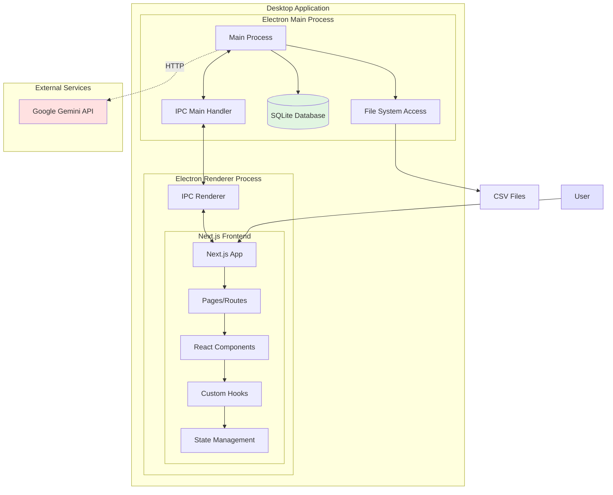
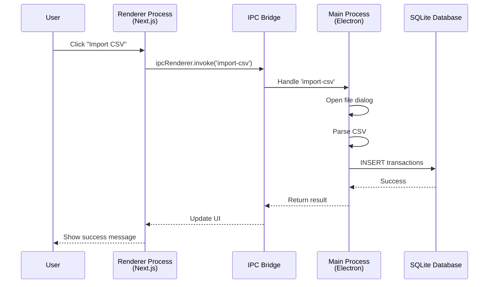
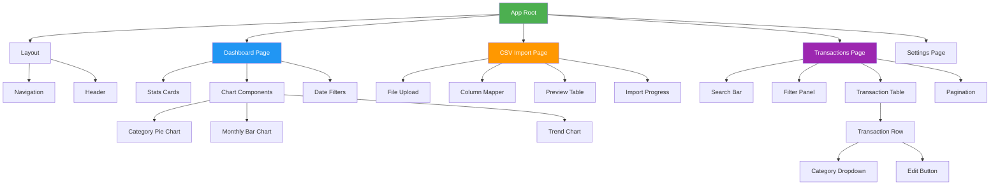
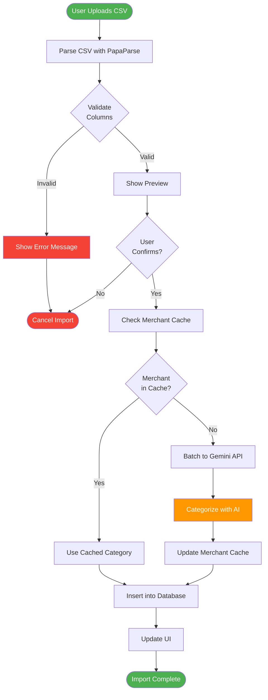
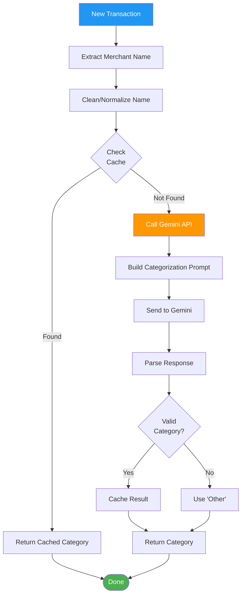
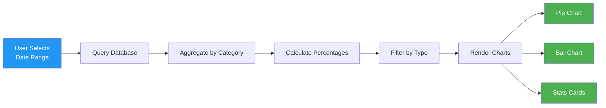
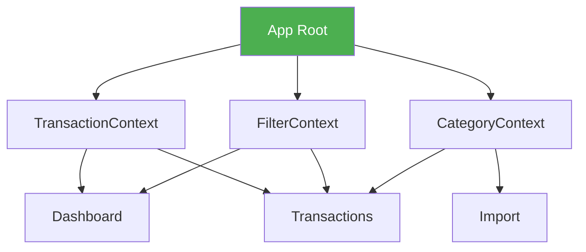

# System Architecture

## Table of Contents

- [Overview](#overview)
- [Architecture Principles](#architecture-principles)
- [System Architecture](#system-architecture)
- [Electron Process Architecture](#electron-process-architecture)
- [Component Hierarchy](#component-hierarchy)
- [Data Flow](#data-flow)
- [Technology Stack](#technology-stack)
- [Directory Structure](#directory-structure)
- [Communication Patterns](#communication-patterns)
- [Design Decisions](#design-decisions)
- [Related Documentation](#related-documentation)

## Overview

Vault is a desktop application built with Electron and Next.js. The architecture follows a local-first approach with all data stored in SQLite, using Google's Gemini API only for transaction categorization.

**Key Characteristics:**
- Desktop-only (no web deployment)
- Local data storage (SQLite)
- Privacy-focused (minimal external communication)
- Single-user application (no authentication)

## Architecture Principles

### 1. Privacy by Design
- All transaction data stored locally
- No cloud sync or remote storage
- Minimal data transmission (merchant names only for categorization)
- No user tracking or analytics

### 2. Local-First
- SQLite database for persistent storage
- File-based configuration
- No network dependency (except for categorization)
- Works offline for viewing and manual categorization

### 3. Separation of Concerns
- Electron main process handles file system and database
- Renderer process (Next.js) handles UI and user interactions
- IPC bridge for secure communication
- Clear boundaries between layers

### 4. Simplicity
- Single-user design (no multi-user complexity)
- No authentication or authorization
- Direct database access (no API layer)
- Minimal dependencies

## System Architecture



## Electron Process Architecture

Electron applications run in two types of processes:

### Main Process

**Responsibilities:**
- Application lifecycle management
- Window creation and management
- Native OS interactions (file dialogs, menus)
- Database operations (SQLite)
- File system access

**Key Files:**
- `src/electron/main/main.ts` - Entry point
- `src/electron/main/window.ts` - Window management
- `src/electron/main/database.ts` - Database connection
- `src/electron/main/ipc-handlers.ts` - IPC event handlers

### Renderer Process

**Responsibilities:**
- UI rendering (Next.js React app)
- User interactions
- Data visualization
- State management

**Key Files:**
- `src/app/` - Next.js app directory
- `src/components/` - React components
- `src/lib/hooks/` - Custom React hooks

### Process Communication



### Security Model

Electron security features enabled:

```javascript
{
  contextIsolation: true,      // Isolate renderer from Node.js
  nodeIntegration: false,       // Disable Node.js in renderer
  sandbox: true,                // Sandbox renderer processes
  enableRemoteModule: false     // Disable remote module
}
```

## Component Hierarchy



### Component Categories

**Layout Components:**
- `Layout` - Main app layout with navigation
- `Header` - Top app bar
- `Navigation` - Side navigation menu

**Dashboard Components:**
- `StatsCards` - Summary statistics
- `CategoryPieChart` - Spending by category
- `MonthlyBarChart` - Month-over-month spending
- `DateRangeFilter` - Date selection

**Import Components:**
- `CsvUploader` - Drag-drop file upload
- `ColumnMapper` - Map CSV columns to fields
- `ImportPreview` - Preview before import
- `ImportProgress` - Progress indicator

**Transaction Components:**
- `TransactionTable` - Data table
- `TransactionRow` - Individual row
- `CategoryEditor` - Inline category editor
- `SearchFilter` - Search and filter UI

## Data Flow

### CSV Import Flow



### Transaction Categorization Flow



### Dashboard Data Flow



## Technology Stack

### Frontend

| Technology | Purpose | Version |
|------------|---------|---------|
| **Next.js** | React framework | 14.x |
| **React** | UI library | 18.x |
| **TypeScript** | Type safety | 5.x |
| **Tailwind CSS** | Styling | 3.x |
| **Recharts** | Data visualization | 2.x |
| **PapaParse** | CSV parsing | 5.x |

### Desktop

| Technology | Purpose | Version |
|------------|---------|---------|
| **Electron** | Desktop wrapper | 28.x |
| **electron-builder** | Build/package | 24.x |

### Database

| Technology | Purpose | Version |
|------------|---------|---------|
| **SQLite** | Local database | 3.x |
| **better-sqlite3** | Node.js SQLite binding | 9.x |

### AI/External Services

| Technology | Purpose | Version |
|------------|---------|---------|
| **Google Gemini API** | Transaction categorization | Latest |
| **@google/generative-ai** | Gemini SDK | Latest |

### Development Tools

| Technology | Purpose |
|------------|---------|
| **ESLint** | Linting |
| **Prettier** | Code formatting |
| **Jest** | Testing framework |
| **React Testing Library** | Component testing |

## Directory Structure

```
vault/
├── src/
│   ├── app/                    # Next.js App Router
│   │   ├── page.tsx           # Dashboard page
│   │   ├── import/
│   │   │   └── page.tsx       # CSV import page
│   │   ├── transactions/
│   │   │   └── page.tsx       # Transactions list page
│   │   ├── layout.tsx         # Root layout
│   │   └── globals.css        # Global styles
│   │
│   ├── components/            # React components
│   │   ├── ui/               # Reusable UI components
│   │   │   ├── Button.tsx
│   │   │   ├── Card.tsx
│   │   │   ├── Table.tsx
│   │   │   └── Select.tsx
│   │   ├── features/         # Feature-specific components
│   │   │   ├── csv-import/
│   │   │   │   ├── CsvUploader.tsx
│   │   │   │   ├── ColumnMapper.tsx
│   │   │   │   └── ImportPreview.tsx
│   │   │   ├── dashboard/
│   │   │   │   ├── StatsCards.tsx
│   │   │   │   ├── CategoryPieChart.tsx
│   │   │   │   └── MonthlyBarChart.tsx
│   │   │   └── transactions/
│   │   │       ├── TransactionTable.tsx
│   │   │       ├── TransactionRow.tsx
│   │   │       └── FilterPanel.tsx
│   │   └── layouts/
│   │       ├── AppLayout.tsx
│   │       └── Navigation.tsx
│   │
│   ├── lib/                   # Utilities and helpers
│   │   ├── hooks/            # Custom React hooks
│   │   │   ├── useTransactions.ts
│   │   │   ├── useCategories.ts
│   │   │   └── useImport.ts
│   │   ├── utils/            # Utility functions
│   │   │   ├── csv-parser.ts
│   │   │   ├── date-formatter.ts
│   │   │   └── currency-formatter.ts
│   │   ├── constants/        # Constants and enums
│   │   │   └── categories.ts
│   │   └── types/            # TypeScript types
│   │       └── transaction.ts
│   │
│   ├── electron/             # Electron-specific code
│   │   ├── main/            # Main process
│   │   │   ├── main.ts      # Entry point
│   │   │   ├── window.ts    # Window management
│   │   │   ├── database.ts  # Database connection
│   │   │   ├── ipc-handlers.ts  # IPC handlers
│   │   │   └── menu.ts      # Application menu
│   │   └── preload/         # Preload scripts
│   │       └── preload.ts   # IPC bridge
│   │
│   └── db/                   # Database layer
│       ├── schema/          # Schema definitions
│       │   └── schema.sql
│       ├── migrations/      # Schema migrations
│       └── queries/         # Query functions
│           ├── transactions.ts
│           └── merchants.ts
│
├── public/                   # Static assets
│   └── icons/               # App icons
│
├── docs/                     # Documentation
├── .env.example             # Environment variables template
├── electron-builder.yml     # Electron builder config
├── next.config.js           # Next.js configuration
├── tsconfig.json            # TypeScript config
├── tailwind.config.js       # Tailwind config
└── package.json             # Dependencies and scripts
```

## Communication Patterns

### IPC Communication

Electron uses Inter-Process Communication (IPC) for main-renderer communication:

**Preload Script (`preload.ts`):**
```typescript
import { contextBridge, ipcRenderer } from 'electron';

contextBridge.exposeInMainWorld('electronAPI', {
  // Database operations
  getTransactions: (filters) => ipcRenderer.invoke('db:get-transactions', filters),
  addTransaction: (transaction) => ipcRenderer.invoke('db:add-transaction', transaction),
  updateTransaction: (id, updates) => ipcRenderer.invoke('db:update-transaction', id, updates),

  // File operations
  selectCsvFile: () => ipcRenderer.invoke('file:select-csv'),
  importCsv: (filePath, mapping) => ipcRenderer.invoke('file:import-csv', filePath, mapping),

  // Categorization
  categorizeTransaction: (merchant) => ipcRenderer.invoke('ai:categorize', merchant),
});
```

**Usage in React Component:**
```typescript
const TransactionList = () => {
  const [transactions, setTransactions] = useState([]);

  useEffect(() => {
    const loadTransactions = async () => {
      const data = await window.electronAPI.getTransactions({
        dateFrom: '2024-01-01',
        dateTo: '2024-12-31'
      });
      setTransactions(data);
    };
    loadTransactions();
  }, []);

  // ...
};
```

### State Management

**Approach:** React hooks + Context API (no Redux)



**Example Context:**
```typescript
// src/lib/contexts/TransactionContext.tsx
const TransactionContext = createContext<TransactionContextType | undefined>(undefined);

export function TransactionProvider({ children }) {
  const [transactions, setTransactions] = useState<Transaction[]>([]);
  const [loading, setLoading] = useState(false);

  const loadTransactions = async (filters: Filters) => {
    setLoading(true);
    const data = await window.electronAPI.getTransactions(filters);
    setTransactions(data);
    setLoading(false);
  };

  return (
    <TransactionContext.Provider value={{ transactions, loading, loadTransactions }}>
      {children}
    </TransactionContext.Provider>
  );
}
```

## Design Decisions

### Why Electron + Next.js?

**Pros:**
- Desktop-native feel with web development workflow
- Next.js provides excellent React developer experience
- File system and database access via Electron
- Single codebase for all platforms (macOS, Windows, Linux)
- No browser security restrictions

**Cons:**
- Larger bundle size than native apps
- Electron overhead (Chromium + Node.js)

**Decision:** Benefits outweigh costs for a single-developer project prioritizing development speed.

### Why SQLite?

**Pros:**
- Zero configuration
- File-based (easy backups)
- Fast for local queries
- No server management
- ACID compliant
- Wide adoption and tooling

**Cons:**
- No concurrent write access (not needed for single-user app)
- Limited to local storage

**Decision:** Perfect fit for local-first, single-user application.

### Why Gemini API for Categorization?

**Pros:**
- High accuracy for merchant name interpretation
- Handles messy transaction descriptions
- No need for complex rule-based logic
- Continuously improving model
- Caching reduces API costs

**Cons:**
- Requires internet connection for new merchants
- Costs money (minimal with caching)
- Sends merchant names to Google

**Decision:** User can manually categorize if preferred. AI is opt-in convenience.

### Why No Cloud Sync?

**Pros:**
- Complete privacy (data never leaves device)
- No authentication complexity
- No server costs
- No GDPR/compliance concerns
- Simpler architecture

**Cons:**
- No multi-device access
- No backup unless user manually backs up

**Decision:** Privacy and simplicity prioritized over convenience for initial version.

### Why No User Authentication?

**Pros:**
- Single-user desktop app doesn't need it
- Simpler codebase
- No password management
- Faster development

**Cons:**
- Anyone with computer access can view data

**Decision:** OS-level user accounts and disk encryption provide sufficient security.

## Related Documentation

- [Database Schema](DATABASE.md) - SQLite database structure
- [API Integration](API.md) - Gemini API integration details
- [Features](FEATURES.md) - Feature specifications and workflows
- [Development Guide](DEVELOPMENT.md) - Development setup and guidelines
- [Security Policy](../SECURITY.md) - Security and privacy practices
