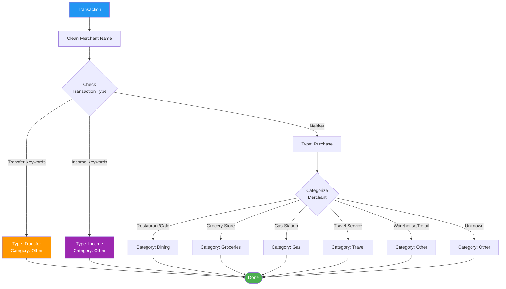
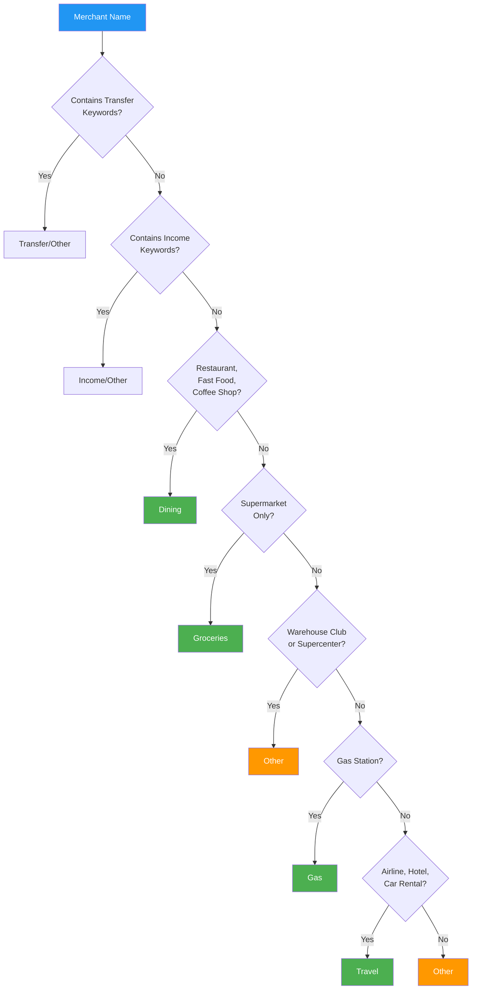

# Transaction Categories

## Table of Contents

- [Overview](#overview)
- [Category Definitions](#category-definitions)
- [Transaction Types](#transaction-types)
- [Classification Logic](#classification-logic)
- [Category Decision Tree](#category-decision-tree)
- [Merchant Examples](#merchant-examples)
- [Edge Cases](#edge-cases)
- [Manual Override Process](#manual-override-process)
- [Future Category Expansion](#future-category-expansion)
- [Related Documentation](#related-documentation)

## Overview

Vault uses a simplified 5-category system designed to analyze credit card rewards optimization:

- **Dining** - Restaurants and food establishments
- **Groceries** - Supermarkets and grocery stores
- **Gas** - Fuel and gas stations
- **Travel** - Airlines, hotels, and travel services
- **Other** - Everything else

This categorization aligns with common credit card reward categories, making it easy to identify which cards offer the best rewards for your spending patterns.

## Category Definitions

### Dining

**Purpose:** Track restaurant and food service spending

**Includes:**
- Restaurants (sit-down, casual, fine dining)
- Fast food chains (McDonald's, Chipotle, Chick-fil-A)
- Coffee shops (Starbucks, Dunkin', local cafes)
- Bars and breweries
- Food delivery services (DoorDash, Uber Eats, Grubhub)
- Bakeries and dessert shops

**Excludes:**
- Grocery stores (even if they have prepared food sections)
- Convenience stores (classified as Other)
- Alcohol from liquor stores (classified as Other)

**Credit Card Alignment:**
Most credit cards define "dining" similarly, making this category directly useful for rewards optimization.

**Example Merchants:**
```
✓ STARBUCKS
✓ CHIPOTLE MEXICAN GRILL
✓ MCDONALDS
✓ PANERA BREAD
✓ UBER EATS
✓ DOORDASH
✓ DOMINOS PIZZA
```

### Groceries

**Purpose:** Track supermarket and grocery spending

**Includes:**
- Supermarkets (Whole Foods, Safeway, Kroger, Publix)
- Specialty grocery stores (Trader Joe's, Sprouts)
- Farmers markets (when identifiable)

**Excludes:**
- Warehouse clubs (Costco, Sam's Club, BJ's) → classified as Other
  - *Reason:* These sell groceries but also general merchandise; spending is mixed
- Convenience stores (7-Eleven, Circle K) → classified as Other
- Restaurants and prepared food establishments → classified as Dining
- Supercenters (Target, Walmart) → classified as Other
  - *Reason:* Mixed merchandise (groceries + general retail)

**Credit Card Alignment:**
Most cards exclude warehouse clubs and supercenters from grocery category, matching our classification.

**Example Merchants:**
```
✓ WHOLE FOODS MARKET
✓ TRADER JOES
✓ SAFEWAY
✓ KROGER
✓ SPROUTS FARMERS MARKET
✓ ALDI

✗ COSTCO (Other)
✗ TARGET (Other)
✗ WALMART (Other)
```

### Gas

**Purpose:** Track fuel spending

**Includes:**
- Gas stations (Shell, Chevron, Exxon, BP)
- Truck stops
- Fuel-only transactions at warehouse clubs (when identifiable)

**Excludes:**
- Convenience store purchases at gas stations (hard to distinguish)
- Electric vehicle charging (classified as Other for now)

**Credit Card Alignment:**
Matches standard credit card "gas station" category.

**Example Merchants:**
```
✓ SHELL OIL
✓ CHEVRON
✓ EXXON MOBIL
✓ BP GAS STATION
✓ MARATHON
✓ SUNOCO
```

### Travel

**Purpose:** Track travel-related spending

**Includes:**
- Airlines (flights, baggage fees)
- Hotels and motels
- Car rentals
- Ride-sharing for travel (Uber/Lyft to airport)
- Travel booking sites (Expedia, Booking.com)
- Airbnb and vacation rentals
- Cruise lines
- Trains and buses (Amtrak, Greyhound)

**Excludes:**
- Daily commute ride-sharing → classified as Other
- Gas for road trips → classified as Gas
- Restaurants while traveling → classified as Dining

**Credit Card Alignment:**
Matches typical "travel" rewards categories.

**Example Merchants:**
```
✓ UNITED AIRLINES
✓ DELTA AIR LINES
✓ MARRIOTT HOTEL
✓ HILTON HOTELS
✓ ENTERPRISE RENT A CAR
✓ AIRBNB
✓ BOOKING.COM
✓ UBER (to airport - context-dependent)
```

### Other

**Purpose:** Catch-all for non-reward-optimized spending

**Includes:**
- General retail (Target, Walmart, Amazon)
- Warehouse clubs (Costco, Sam's Club)
- Online shopping
- Subscriptions (Netflix, Spotify, gym memberships)
- Utilities
- Healthcare
- Personal services (haircuts, dry cleaning)
- Financial transfers (Zelle, Venmo, PayPal)
- Income deposits
- Everything not fitting above categories

**Example Merchants:**
```
✓ AMAZON.COM
✓ TARGET
✓ WALMART
✓ COSTCO
✓ NETFLIX
✓ VERIZON WIRELESS
✓ ZELLE TRANSFER
✓ WALGREENS PHARMACY
```

## Transaction Types

In addition to spending categories, transactions are classified by **type**:

### Purchase

**Definition:** Standard spending transactions

**Characteristics:**
- Positive amount (money leaving account)
- Merchant selling goods or services
- Most common type

**Examples:**
```
✓ STARBUCKS - $6.75 (Dining purchase)
✓ SHELL GAS - $45.00 (Gas purchase)
✓ TARGET - $87.32 (Other purchase)
```

### Transfer

**Definition:** Money movement between accounts (not spending)

**Characteristics:**
- Peer-to-peer payments
- Bank transfers
- ATM withdrawals
- Not tied to goods/services

**Examples:**
```
✓ ZELLE SENT TO JOHN DOE
✓ VENMO PAYMENT
✓ PAYPAL TRANSFER
✓ ATM WITHDRAWAL
✓ BANK TRANSFER
```

**Dashboard Treatment:**
- Excluded from category spending analysis (not "real" spending)
- Can be filtered separately
- Helps calculate cash flow

### Income

**Definition:** Money coming into account

**Characteristics:**
- Negative amount (in bank export context)
- Deposits, paychecks, refunds

**Examples:**
```
✓ DIRECT DEPOSIT - PAYCHECK
✓ REFUND FROM AMAZON
✓ REIMBURSEMENT
✓ INTEREST PAYMENT
```

**Dashboard Treatment:**
- Excluded from spending analysis
- Can be tracked separately for cash flow

## Classification Logic

### Decision Flow



### Classification Keywords

**Transfer Detection:**
```typescript
const transferKeywords = [
  'ZELLE',
  'VENMO',
  'PAYPAL',
  'CASHAPP',
  'ATM WITHDRAWAL',
  'TRANSFER TO',
  'TRANSFER FROM',
  'WIRE TRANSFER'
];
```

**Income Detection:**
```typescript
const incomeKeywords = [
  'DIRECT DEPOSIT',
  'PAYCHECK',
  'SALARY',
  'REFUND',
  'REIMBURSEMENT',
  'INTEREST PAYMENT',
  'DIVIDEND'
];
```

**Category Keywords:**
```typescript
const categoryKeywords = {
  Dining: [
    'RESTAURANT',
    'STARBUCKS',
    'MCDONALDS',
    'CHIPOTLE',
    'PANERA',
    'DOORDASH',
    'UBER EATS',
    'GRUBHUB',
    'CAFE',
    'PIZZA'
  ],
  Groceries: [
    'WHOLE FOODS',
    'TRADER JOES',
    'SAFEWAY',
    'KROGER',
    'PUBLIX',
    'ALDI',
    'SPROUTS'
  ],
  Gas: [
    'SHELL',
    'CHEVRON',
    'EXXON',
    'BP GAS',
    'MARATHON',
    'SUNOCO',
    'MOBIL',
    'GAS STATION'
  ],
  Travel: [
    'AIRLINES',
    'UNITED',
    'DELTA',
    'AMERICAN AIRLINES',
    'HOTEL',
    'MARRIOTT',
    'HILTON',
    'AIRBNB',
    'RENTAL CAR',
    'ENTERPRISE'
  ]
};
```

## Category Decision Tree



## Merchant Examples

### Dining Examples

| Merchant | Category | Confidence | Notes |
|----------|----------|------------|-------|
| STARBUCKS #12345 | Dining | High | Coffee shop |
| CHIPOTLE MEXICAN GRILL | Dining | High | Fast casual restaurant |
| MCDONALDS | Dining | High | Fast food |
| PANERA BREAD #0123 | Dining | High | Bakery cafe |
| UBER EATS \*ORDER | Dining | High | Food delivery |
| DOORDASH \*PIZZAHUT | Dining | High | Food delivery |
| THE CHEESECAKE FACTORY | Dining | High | Sit-down restaurant |

### Groceries Examples

| Merchant | Category | Confidence | Notes |
|----------|----------|------------|-------|
| WHOLE FOODS MARKET | Groceries | High | Supermarket |
| TRADER JOES #456 | Groceries | High | Specialty grocery |
| SAFEWAY #1234 | Groceries | High | Supermarket chain |
| KROGER FUEL CENTER | Other | Medium | Fuel, not groceries |
| SPROUTS FARMERS MARKET | Groceries | High | Specialty grocery |

### Gas Examples

| Merchant | Category | Confidence | Notes |
|----------|----------|------------|-------|
| SHELL OIL 57443423232 | Gas | High | Gas station |
| CHEVRON #012345 | Gas | High | Gas station |
| EXXONMOBIL | Gas | High | Gas station |
| BP GAS STATION | Gas | High | Gas station |

### Travel Examples

| Merchant | Category | Confidence | Notes |
|----------|----------|------------|-------|
| UNITED AIRLINES | Travel | High | Airline |
| DELTA AIR 0062345678901 | Travel | High | Airline |
| MARRIOTT HOTEL | Travel | High | Hotel chain |
| AIRBNB \* HMDECVGTF2 | Travel | High | Vacation rental |
| ENTERPRISE RENT-A-CAR | Travel | High | Car rental |
| UBER \*TRIP | Other | Low | Could be daily commute |

### Other Examples

| Merchant | Category | Confidence | Notes |
|----------|----------|------------|-------|
| AMAZON.COM | Other | High | General retail |
| TARGET T-1234 | Other | High | Supercenter |
| COSTCO WHSE #0123 | Other | High | Warehouse club |
| WALMART SUPERCENTER | Other | High | Supercenter |
| NETFLIX.COM | Other | High | Subscription |
| ZELLE TRANSFER | Other (Transfer) | High | Money transfer |

## Edge Cases

### Ambiguous Merchants

**Costco, Sam's Club, BJ's Wholesale:**
- Sell groceries but also general merchandise
- **Classification:** Other (low confidence)
- **Recommendation:** User should review and manually categorize based on what they bought

**Uber, Lyft:**
- Could be daily commute (Other) or travel to airport (Travel)
- **Classification:** Other (medium confidence)
- **Recommendation:** User manually categorizes based on purpose

**Amazon:**
- Could be groceries (Amazon Fresh), dining (restaurants via Prime), or general retail
- **Classification:** Other (medium confidence)
- **Recommendation:** User reviews individual purchases

**Kroger Fuel Center:**
- Kroger is a grocery chain but "Fuel Center" indicates gas
- **Classification:** Gas (if "fuel" detected), otherwise Groceries

### Hybrid Merchants

Some merchants span multiple categories:

| Merchant | Primary Business | Classification | Notes |
|----------|------------------|----------------|-------|
| Target | General retail | Other | Sells groceries but not a supermarket |
| Walmart Supercenter | General retail | Other | Sells groceries + everything else |
| Costco | Warehouse club | Other | Groceries + gas + general merchandise |
| CVS Pharmacy | Drugstore | Other | Small grocery section, but not a supermarket |
| 7-Eleven | Convenience store | Other | Some food, but not a restaurant |

**Rule:** When merchant spans multiple categories with no clear primary purpose, classify as **Other** and let user override if needed.

### Unknown Merchants

**Examples:**
```
"POS PURCHASE 1234567890"
"SQ *MOBILE PAYMENT"
"POINT OF SALE DEBIT"
```

**Classification:** Other (low confidence)

**Handling:**
- Gemini API attempts to infer from raw description
- If insufficient info, defaults to Other
- User can manually categorize

## Manual Override Process

### Why Override?

1. **Low Confidence:** AI categorization is uncertain
2. **Ambiguous Merchants:** Costco, Uber, etc.
3. **User Preference:** User has specific categorization needs

### How to Override

**UI Flow:**

1. Navigate to Transactions page
2. Find transaction to override
3. Click category dropdown
4. Select new category
5. Change saves immediately
6. Merchant cache updates for future transactions

**Example:**

```
Transaction: COSTCO WHSE #0123
Original: Other (low confidence)
User Action: Change to "Groceries"
Result:
  ✓ Transaction updated to Groceries
  ✓ Future Costco transactions auto-categorize as Groceries
  ✓ Dashboard recalculates percentages
```

### Batch Override

**Future Feature:**

Allow users to override all transactions from a merchant at once:

```
"Change all COSTCO transactions to Groceries?"
[Apply to Past Transactions] [Apply to Future Only] [Cancel]
```

## Future Category Expansion

### Additional Categories (Post-MVP)

Potential categories for enhanced analysis:

| Category | Purpose | Examples |
|----------|---------|----------|
| **Entertainment** | Movies, concerts, sports | AMC Theaters, Spotify, NFL tickets |
| **Drugstores** | Pharmacy, health | CVS, Walgreens, Rite Aid |
| **Streaming** | Subscription services | Netflix, Hulu, Disney+ |
| **Utilities** | Home services | Electric, water, internet |
| **Transit** | Public transportation | Metro, bus, subway passes |
| **Fitness** | Gym, sports | Planet Fitness, yoga studio |
| **Home Improvement** | Hardware, furniture | Home Depot, Lowe's, IKEA |
| **Healthcare** | Doctor, dentist | Medical offices, hospitals |

### Custom Categories

**Future Feature:**

Allow users to create custom categories:

```
User Creates: "Pet Care"
Merchants:
  - PETSMART
  - VETERINARY CLINIC
  - CHEWY.COM
```

### Subcategories

**Future Feature:**

Break categories into subcategories:

```
Dining
  ├── Coffee Shops
  ├── Fast Food
  ├── Casual Dining
  └── Fine Dining

Groceries
  ├── Supermarkets
  ├── Specialty Stores
  └── Farmers Markets
```

## Related Documentation

- [Features](FEATURES.md) - Feature specifications
- [API Integration](API.md) - Gemini AI categorization
- [Database Schema](DATABASE.md) - Category storage
- [Architecture](ARCHITECTURE.md) - System design
