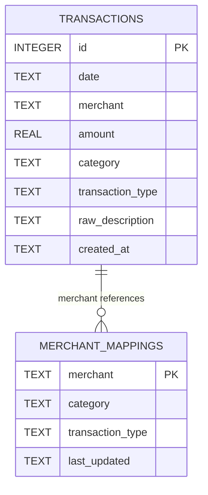

# Database Schema

## Table of Contents

- [Overview](#overview)
- [Database Technology](#database-technology)
- [Schema Diagram](#schema-diagram)
- [Tables](#tables)
  - [transactions](#transactions-table)
  - [merchant_mappings](#merchant_mappings-table)
- [Indexes](#indexes)
- [Sample Queries](#sample-queries)
- [Data Integrity](#data-integrity)
- [Migrations](#migrations)
- [Backup and Restore](#backup-and-restore)
- [Related Documentation](#related-documentation)

## Overview

Vault uses SQLite for local data storage. The database consists of two primary tables:

1. **transactions** - Stores all transaction records
2. **merchant_mappings** - Caches merchant-to-category mappings for performance

The schema is designed for:
- Fast querying for dashboard analytics
- Efficient category lookups via caching
- Simple data model (no complex relationships)
- Easy CSV import/export

## Database Technology

**SQLite Version:** 3.x
**Node.js Library:** better-sqlite3 (v9.x)

**Database Location:**
- **macOS:** `~/Library/Application Support/Vault/transactions.db`
- **Windows:** `%APPDATA%\Vault\transactions.db`
- **Linux:** `~/.config/Vault/transactions.db`

**Key Characteristics:**
- File-based (single `.db` file)
- ACID compliant
- No server required
- Synchronous API (blocking)
- Thread-safe for single-writer scenarios

## Schema Diagram



### Relationship Notes

- `transactions.merchant` can reference `merchant_mappings.merchant` (soft relationship)
- No foreign key constraints (SQLite supports them, but not needed here)
- `merchant_mappings` acts as a cache, not a strict relationship

## Tables

### transactions Table

Stores all imported transaction records.

#### Schema Definition

```sql
CREATE TABLE IF NOT EXISTS transactions (
  id INTEGER PRIMARY KEY AUTOINCREMENT,
  date TEXT NOT NULL,
  merchant TEXT NOT NULL,
  amount REAL NOT NULL,
  category TEXT NOT NULL,
  transaction_type TEXT NOT NULL DEFAULT 'purchase',
  raw_description TEXT,
  created_at TEXT NOT NULL DEFAULT CURRENT_TIMESTAMP
);
```

#### Field Descriptions

| Field | Type | Constraints | Description |
|-------|------|-------------|-------------|
| `id` | INTEGER | PRIMARY KEY, AUTO INCREMENT | Unique transaction identifier |
| `date` | TEXT | NOT NULL | Transaction date (ISO 8601: `YYYY-MM-DD`) |
| `merchant` | TEXT | NOT NULL | Merchant/vendor name |
| `amount` | REAL | NOT NULL | Transaction amount (positive for purchases, negative for refunds) |
| `category` | TEXT | NOT NULL | Spending category (`Dining`, `Groceries`, `Gas`, `Travel`, `Other`) |
| `transaction_type` | TEXT | NOT NULL, DEFAULT `'purchase'` | Type: `purchase`, `transfer`, `income` |
| `raw_description` | TEXT | NULLABLE | Original transaction description from CSV |
| `created_at` | TEXT | NOT NULL, DEFAULT CURRENT_TIMESTAMP | Record creation timestamp (ISO 8601) |

#### Field Details

**date:**
- Format: `YYYY-MM-DD` (e.g., `2024-03-15`)
- Stored as TEXT for compatibility and ease of querying
- Indexed for fast date range queries

**merchant:**
- Cleaned/normalized merchant name
- Examples: `STARBUCKS`, `TARGET`, `SHELL GAS STATION`
- Used for categorization lookups

**amount:**
- Positive values: purchases, expenses
- Negative values: refunds, returns
- Stored as REAL (floating-point)
- Display formatting handled in application layer

**category:**
- Enum-like values: `Dining`, `Groceries`, `Gas`, `Travel`, `Other`
- Set by Gemini API or manual user override
- Can be changed after import

**transaction_type:**
- `purchase` - Standard spending transaction
- `transfer` - Money movement (Zelle, Venmo, bank transfers)
- `income` - Deposits, paychecks, refunds

**raw_description:**
- Original description from bank CSV
- Preserved for reference and debugging
- May include extra metadata (location, auth codes, etc.)

#### Sample Data

```sql
INSERT INTO transactions (date, merchant, amount, category, transaction_type, raw_description)
VALUES
  ('2024-03-15', 'STARBUCKS #12345', 6.75, 'Dining', 'purchase', 'STARBUCKS STORE #12345 SEATTLE WA'),
  ('2024-03-16', 'WHOLE FOODS MARKET', 87.32, 'Groceries', 'purchase', 'WHOLE FOODS MKT #10250 AUSTIN TX'),
  ('2024-03-17', 'SHELL GAS STATION', 45.00, 'Gas', 'purchase', 'SHELL OIL 57443423232 HOUSTON TX'),
  ('2024-03-18', 'ZELLE TRANSFER', 100.00, 'Other', 'transfer', 'ZELLE SENT TO JOHN DOE'),
  ('2024-03-19', 'PAYCHECK DEPOSIT', -3500.00, 'Other', 'income', 'DIRECT DEPOSIT ACME CORP');
```

### merchant_mappings Table

Caches merchant-to-category mappings to avoid repeated API calls.

#### Schema Definition

```sql
CREATE TABLE IF NOT EXISTS merchant_mappings (
  merchant TEXT PRIMARY KEY,
  category TEXT NOT NULL,
  transaction_type TEXT NOT NULL DEFAULT 'purchase',
  last_updated TEXT NOT NULL DEFAULT CURRENT_TIMESTAMP
);
```

#### Field Descriptions

| Field | Type | Constraints | Description |
|-------|------|-------------|-------------|
| `merchant` | TEXT | PRIMARY KEY | Normalized merchant name |
| `category` | TEXT | NOT NULL | Mapped category |
| `transaction_type` | TEXT | NOT NULL, DEFAULT `'purchase'` | Transaction type |
| `last_updated` | TEXT | NOT NULL, DEFAULT CURRENT_TIMESTAMP | Last cache update timestamp |

#### Purpose

This table serves as a **cache** to:
1. Avoid redundant Gemini API calls
2. Speed up CSV imports (pre-categorized merchants)
3. Allow manual overrides to persist
4. Reduce API costs

**Cache Lookup Flow:**
1. New transaction arrives with merchant name
2. Query `merchant_mappings` for merchant
3. If found: use cached category
4. If not found: call Gemini API, then insert into cache

#### Sample Data

```sql
INSERT INTO merchant_mappings (merchant, category, transaction_type)
VALUES
  ('STARBUCKS', 'Dining', 'purchase'),
  ('WHOLE FOODS', 'Groceries', 'purchase'),
  ('SHELL', 'Gas', 'purchase'),
  ('UNITED AIRLINES', 'Travel', 'purchase'),
  ('ZELLE', 'Other', 'transfer'),
  ('VENMO', 'Other', 'transfer');
```

## Indexes

Indexes improve query performance for common operations.

### Primary Indexes

```sql
-- Automatically created by PRIMARY KEY constraints
CREATE UNIQUE INDEX idx_transactions_id ON transactions(id);
CREATE UNIQUE INDEX idx_merchant_mappings_merchant ON merchant_mappings(merchant);
```

### Additional Indexes

```sql
-- Speed up date range queries
CREATE INDEX idx_transactions_date ON transactions(date);

-- Speed up category filtering
CREATE INDEX idx_transactions_category ON transactions(category);

-- Speed up transaction type filtering
CREATE INDEX idx_transactions_type ON transactions(transaction_type);

-- Composite index for common dashboard queries
CREATE INDEX idx_transactions_date_category ON transactions(date, category);

-- Index for merchant lookups during import
CREATE INDEX idx_transactions_merchant ON transactions(merchant);
```

### Index Usage Examples

```sql
-- Fast query using idx_transactions_date
SELECT * FROM transactions WHERE date BETWEEN '2024-01-01' AND '2024-12-31';

-- Fast query using idx_transactions_date_category
SELECT category, SUM(amount) FROM transactions
WHERE date >= '2024-01-01' AND transaction_type = 'purchase'
GROUP BY category;
```

## Sample Queries

### Common Operations

#### 1. Get All Transactions for a Date Range

```sql
SELECT *
FROM transactions
WHERE date BETWEEN '2024-01-01' AND '2024-12-31'
  AND transaction_type = 'purchase'
ORDER BY date DESC;
```

#### 2. Calculate Spending by Category

```sql
SELECT
  category,
  SUM(amount) as total_spent,
  COUNT(*) as transaction_count,
  AVG(amount) as avg_transaction
FROM transactions
WHERE
  date BETWEEN '2024-01-01' AND '2024-12-31'
  AND transaction_type = 'purchase'
  AND amount > 0
GROUP BY category
ORDER BY total_spent DESC;
```

#### 3. Get Top Merchants by Spending

```sql
SELECT
  merchant,
  category,
  SUM(amount) as total_spent,
  COUNT(*) as visit_count
FROM transactions
WHERE
  date BETWEEN '2024-01-01' AND '2024-12-31'
  AND transaction_type = 'purchase'
GROUP BY merchant, category
ORDER BY total_spent DESC
LIMIT 10;
```

#### 4. Monthly Spending Breakdown

```sql
SELECT
  strftime('%Y-%m', date) as month,
  category,
  SUM(amount) as total
FROM transactions
WHERE transaction_type = 'purchase'
GROUP BY month, category
ORDER BY month DESC, total DESC;
```

#### 5. Check Merchant Cache

```sql
SELECT *
FROM merchant_mappings
WHERE merchant LIKE '%STARBUCKS%';
```

#### 6. Get Uncategorized Transactions

```sql
SELECT *
FROM transactions
WHERE category = 'Other'
  AND transaction_type = 'purchase'
ORDER BY date DESC;
```

### Advanced Queries

#### Calculate Category Percentages

```sql
WITH category_totals AS (
  SELECT
    category,
    SUM(amount) as category_total
  FROM transactions
  WHERE
    date BETWEEN '2024-01-01' AND '2024-12-31'
    AND transaction_type = 'purchase'
    AND amount > 0
  GROUP BY category
),
grand_total AS (
  SELECT SUM(amount) as total
  FROM transactions
  WHERE
    date BETWEEN '2024-01-01' AND '2024-12-31'
    AND transaction_type = 'purchase'
    AND amount > 0
)
SELECT
  ct.category,
  ct.category_total,
  ROUND((ct.category_total / gt.total) * 100, 2) as percentage
FROM category_totals ct, grand_total gt
ORDER BY ct.category_total DESC;
```

#### Find Duplicate Transactions

```sql
SELECT
  date,
  merchant,
  amount,
  COUNT(*) as duplicate_count
FROM transactions
GROUP BY date, merchant, amount
HAVING COUNT(*) > 1;
```

#### Search Transactions

```sql
SELECT *
FROM transactions
WHERE
  (merchant LIKE '%search_term%' OR raw_description LIKE '%search_term%')
  AND date BETWEEN '2024-01-01' AND '2024-12-31'
ORDER BY date DESC
LIMIT 50;
```

## Data Integrity

### Constraints

**transactions table:**
- `id` must be unique (PRIMARY KEY)
- `date`, `merchant`, `amount`, `category`, `transaction_type` cannot be NULL
- `created_at` automatically set to current timestamp

**merchant_mappings table:**
- `merchant` must be unique (PRIMARY KEY)
- `category`, `transaction_type` cannot be NULL

### Validation (Application Layer)

The following validations are enforced in the application code:

**transactions:**
- `date` must be valid ISO 8601 date (`YYYY-MM-DD`)
- `amount` must be a valid number
- `category` must be one of: `Dining`, `Groceries`, `Gas`, `Travel`, `Other`
- `transaction_type` must be one of: `purchase`, `transfer`, `income`

**merchant_mappings:**
- `merchant` normalized to uppercase for consistency
- `category` and `transaction_type` validated against allowed values

### Example Validation Code

```typescript
function validateTransaction(transaction: Partial<Transaction>): boolean {
  const validCategories = ['Dining', 'Groceries', 'Gas', 'Travel', 'Other'];
  const validTypes = ['purchase', 'transfer', 'income'];

  if (!transaction.date || !isValidDate(transaction.date)) {
    throw new Error('Invalid date format');
  }

  if (typeof transaction.amount !== 'number') {
    throw new Error('Amount must be a number');
  }

  if (!validCategories.includes(transaction.category!)) {
    throw new Error(`Invalid category: ${transaction.category}`);
  }

  if (!validTypes.includes(transaction.transaction_type!)) {
    throw new Error(`Invalid transaction type: ${transaction.transaction_type}`);
  }

  return true;
}
```

## Migrations

### Migration Strategy

**Current Approach:**
- Schema defined in `src/db/schema/schema.sql`
- Database created on first app launch
- No migrations needed yet (pre-release)

**Future Approach:**

When schema changes are needed:

1. Create migration file: `migrations/001_add_column.sql`
2. Track applied migrations in `schema_migrations` table
3. Apply migrations on app startup

**Example Migration System:**

```sql
-- migrations table to track applied migrations
CREATE TABLE IF NOT EXISTS schema_migrations (
  version INTEGER PRIMARY KEY,
  applied_at TEXT NOT NULL DEFAULT CURRENT_TIMESTAMP
);
```

**Migration file example (`migrations/002_add_notes_column.sql`):**

```sql
ALTER TABLE transactions ADD COLUMN notes TEXT;
```

**Migration runner (TypeScript):**

```typescript
async function runMigrations(db: Database) {
  const migrations = [
    { version: 1, file: 'migrations/001_initial_schema.sql' },
    { version: 2, file: 'migrations/002_add_notes_column.sql' },
  ];

  for (const migration of migrations) {
    const applied = db.prepare(
      'SELECT version FROM schema_migrations WHERE version = ?'
    ).get(migration.version);

    if (!applied) {
      const sql = readFileSync(migration.file, 'utf-8');
      db.exec(sql);
      db.prepare(
        'INSERT INTO schema_migrations (version) VALUES (?)'
      ).run(migration.version);
      console.log(`Applied migration ${migration.version}`);
    }
  }
}
```

## Backup and Restore

### Backup

**Manual Backup:**

```bash
# Copy database file
cp ~/Library/Application\ Support/Vault/transactions.db \
   ~/Backups/transactions-2024-03-15.db
```

**Automated Backup (Future Feature):**

```typescript
function backupDatabase(dbPath: string, backupDir: string) {
  const timestamp = new Date().toISOString().split('T')[0];
  const backupPath = path.join(backupDir, `transactions-${timestamp}.db`);
  copyFileSync(dbPath, backupPath);
  console.log(`Backup created: ${backupPath}`);
}
```

### Restore

**Restore from Backup:**

```bash
# Stop application first
# Then replace database file
cp ~/Backups/transactions-2024-03-15.db \
   ~/Library/Application\ Support/Vault/transactions.db
```

### Export to CSV

```typescript
function exportToCSV(db: Database, outputPath: string) {
  const transactions = db.prepare('SELECT * FROM transactions ORDER BY date DESC').all();
  const csv = Papa.unparse(transactions);
  writeFileSync(outputPath, csv);
}
```

### Import from CSV (Restore)

Use the built-in CSV import feature in the app.

## Related Documentation

- [Architecture](ARCHITECTURE.md) - System architecture and design
- [API Integration](API.md) - Gemini API for categorization
- [Features](FEATURES.md) - Feature specifications
- [Setup Guide](SETUP.md) - Database setup instructions
