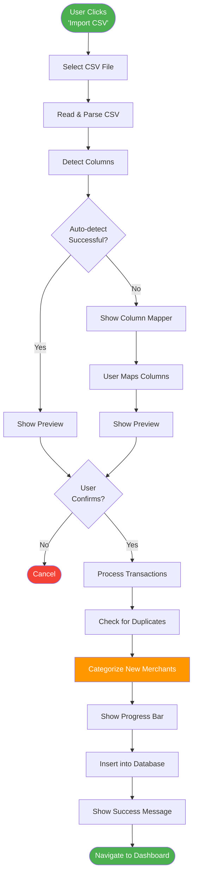

# Features Documentation

## Table of Contents

- [Overview](#overview)
- [Feature Summary](#feature-summary)
- [CSV Import](#csv-import)
- [Automatic Categorization](#automatic-categorization)
- [Dashboard Analytics](#dashboard-analytics)
- [Transaction Management](#transaction-management)
- [Search and Filtering](#search-and-filtering)
- [User Stories](#user-stories)
- [Related Documentation](#related-documentation)

## Overview

Vault provides a streamlined workflow for importing, categorizing, and analyzing credit card transactions. All features are designed to work locally without requiring internet connectivity (except for AI categorization).

## Feature Summary

| Feature | Status | Description |
|---------|--------|-------------|
| **CSV Import** | Planned | Import transaction CSV files from any bank |
| **Column Mapping** | Planned | Map CSV columns to transaction fields |
| **AI Categorization** | Planned | Automatic categorization using Gemini API |
| **Merchant Caching** | Planned | Cache categorizations to reduce API calls |
| **Dashboard** | Planned | Visual spending analytics and charts |
| **Category Breakdown** | Planned | Pie chart of spending by category |
| **Trend Analysis** | Planned | Month-over-month spending trends |
| **Transaction List** | Planned | Searchable, filterable transaction table |
| **Manual Overrides** | Planned | Edit categories and transaction types |
| **Date Filtering** | Planned | Filter by custom date ranges |
| **Export** | Future | Export filtered data to CSV |
| **Budget Tracking** | Future | Set and monitor budget limits |
| **Recurring Detection** | Future | Identify recurring transactions |

## CSV Import

### Purpose

Allow users to import credit card and bank transaction data from CSV exports.

### Workflow



### UI Components

#### 1. File Upload

**Component:** `CsvUploader.tsx`

**Features:**
- Drag-and-drop support
- File picker button
- File size validation (max 10MB)
- CSV format validation

**Example UI:**

```
┌─────────────────────────────────────────┐
│                                         │
│      📁 Drag & Drop CSV File Here      │
│                                         │
│            or click to browse           │
│                                         │
└─────────────────────────────────────────┘
         [Select File Button]
```

#### 2. Column Mapping

**Component:** `ColumnMapper.tsx`

**Purpose:** Map CSV columns to required fields

**Required Fields:**
- Date
- Merchant/Description
- Amount

**Optional Fields:**
- Category (if pre-categorized)
- Transaction Type

**Example UI:**

```
CSV Column          →    Database Field
─────────────────────────────────────────
Date                →    [Date ▼]
Description         →    [Merchant ▼]
Amount              →    [Amount ▼]
Card Type           →    [Ignore ▼]
```

#### 3. Import Preview

**Component:** `ImportPreview.tsx`

**Features:**
- Show first 10 rows
- Highlight detected issues (missing dates, invalid amounts)
- Show total row count
- Confirm/cancel buttons

**Example UI:**

```
Preview: 156 transactions detected

┌──────────────────────────────────────────────────────┐
│ Date       │ Merchant           │ Amount    │ Status │
├──────────────────────────────────────────────────────┤
│ 2024-03-15 │ STARBUCKS #12345  │ $6.75     │ ✓ OK   │
│ 2024-03-16 │ WHOLE FOODS       │ $87.32    │ ✓ OK   │
│ 2024-03-17 │ SHELL GAS         │ $45.00    │ ✓ OK   │
│ ...        │ ...               │ ...       │ ...    │
└──────────────────────────────────────────────────────┘

         [Cancel]  [Import Transactions]
```

#### 4. Import Progress

**Component:** `ImportProgress.tsx`

**Features:**
- Progress bar showing completion percentage
- Current step display
- Categorization status (cached vs. API calls)

**Example UI:**

```
Importing Transactions...

Progress: ████████████░░░░░░░░ 65% (101/156)

Current: Categorizing "TARGET STORE #1234"
  ✓ 45 cached merchants
  ⚡ 20 new categorizations
  ⏳ 36 remaining

         [Cancel Import]
```

### Column Detection Logic

```typescript
interface ColumnMapping {
  date: string;
  merchant: string;
  amount: string;
  category?: string;
}

function detectColumns(headers: string[]): ColumnMapping | null {
  const datePatterns = /date|posted|transaction.*date/i;
  const merchantPatterns = /description|merchant|vendor|payee/i;
  const amountPatterns = /amount|debit|credit|total/i;

  const dateCol = headers.find(h => datePatterns.test(h));
  const merchantCol = headers.find(h => merchantPatterns.test(h));
  const amountCol = headers.find(h => amountPatterns.test(h));

  if (dateCol && merchantCol && amountCol) {
    return {
      date: dateCol,
      merchant: merchantCol,
      amount: amountCol
    };
  }

  return null; // Manual mapping required
}
```

### Duplicate Detection

```typescript
function checkDuplicates(
  transaction: Transaction,
  existingTransactions: Transaction[]
): boolean {
  return existingTransactions.some(
    existing =>
      existing.date === transaction.date &&
      existing.merchant === transaction.merchant &&
      Math.abs(existing.amount - transaction.amount) < 0.01
  );
}
```

## Automatic Categorization

### Purpose

Use AI to automatically assign spending categories to transactions without manual effort.

### Process

1. **Extract merchant name** from transaction description
2. **Check cache** for existing categorization
3. If not cached, **call Gemini API** to categorize
4. **Store result** in merchant_mappings cache
5. **Apply category** to transaction

See [API.md](API.md) for detailed categorization logic.

### User Experience

**Transparent Categorization:**
- Show "Categorizing..." indicator during import
- Display "X cached, Y new" statistics
- Allow users to review and override after import

**Confidence Indicators:**
Users can see low-confidence categorizations for review:

```
Transaction List
─────────────────────────────────────────
STARBUCKS        Dining     ✓ High confidence
COSTCO           Other      ⚠️ Low confidence (review)
TARGET           Other      ⚠️ Low confidence (review)
```

## Dashboard Analytics

### Purpose

Provide visual insights into spending patterns across categories.

### Components

#### 1. Stats Cards

**Component:** `StatsCards.tsx`

**Metrics:**
- Total Spending (selected date range)
- Number of Transactions
- Average Transaction Amount
- Top Category

**Example UI:**

```
┌──────────────┬──────────────┬──────────────┬──────────────┐
│ Total Spent  │ Transactions │ Avg Amount   │ Top Category │
│ $3,245.67    │ 156          │ $20.81       │ Dining       │
└──────────────┴──────────────┴──────────────┴──────────────┘
```

#### 2. Category Pie Chart

**Component:** `CategoryPieChart.tsx`

**Features:**
- Interactive pie chart
- Show category percentages
- Click to filter transactions
- Color-coded by category

**Data:**
```
Dining:     35% ($1,136.98)
Groceries:  28% ($908.79)
Gas:        15% ($486.85)
Travel:     12% ($389.48)
Other:      10% ($323.57)
```

#### 3. Monthly Trend Chart

**Component:** `MonthlyBarChart.tsx`

**Features:**
- Bar chart showing spending by month
- Stacked by category
- Hover to see breakdown
- Filter by category

#### 4. Date Range Filter

**Component:** `DateRangeFilter.tsx`

**Options:**
- Last 30 days
- Last 90 days
- Year-to-date
- All time
- Custom date range

## Transaction Management

### Purpose

Allow users to view, search, filter, and edit transaction details.

### Transaction List

**Component:** `TransactionTable.tsx`

**Features:**
- Sortable columns (date, merchant, amount, category)
- Pagination (50 rows per page)
- Inline category editing
- Delete transactions (with confirmation)

**Example UI:**

```
Transactions (156 total)                    [Export CSV]

Search: [_______________] 🔍

Filters: [All Categories ▼] [All Types ▼] [Last 90 Days ▼]

┌────────────┬─────────────────────┬──────────┬───────────┬─────────┐
│ Date       │ Merchant            │ Amount   │ Category  │ Actions │
├────────────┼─────────────────────┼──────────┼───────────┼─────────┤
│ 2024-03-17 │ STARBUCKS #12345   │ $6.75    │ Dining ▼  │ 🗑️ ✏️  │
│ 2024-03-16 │ WHOLE FOODS        │ $87.32   │ Groceries▼│ 🗑️ ✏️  │
│ 2024-03-15 │ SHELL GAS STATION  │ $45.00   │ Gas ▼     │ 🗑️ ✏️  │
│ ...        │ ...                │ ...      │ ...       │ ...     │
└────────────┴─────────────────────┴──────────┴───────────┴─────────┘

                  < Previous | Page 1 of 4 | Next >
```

### Inline Editing

**Editable Fields:**
- Category (dropdown)
- Transaction Type (dropdown)

**Behavior:**
- Changes save immediately
- Update merchant_mappings cache
- Recalculate dashboard stats

```typescript
async function updateTransactionCategory(
  id: number,
  category: string,
  merchant: string
): Promise<void> {
  // 1. Update transaction
  await db.prepare(
    'UPDATE transactions SET category = ? WHERE id = ?'
  ).run(category, id);

  // 2. Update cache (future transactions from this merchant)
  await updateCachedCategory(merchant, category, 'purchase');

  // 3. Refresh UI
  refreshDashboard();
}
```

## Search and Filtering

### Search

**Search Fields:**
- Merchant name
- Raw description
- Amount (exact match)

**Example:**
```
Search: "starbucks" → Returns all Starbucks transactions
Search: "45.00" → Returns all $45.00 transactions
Search: "whole" → Returns Whole Foods, Whole Paycheck, etc.
```

### Filters

**Category Filter:**
- All Categories
- Dining
- Groceries
- Gas
- Travel
- Other

**Transaction Type Filter:**
- All Types
- Purchases only
- Transfers only
- Income only

**Date Range Filter:**
- Predefined ranges (Last 30/90 days, YTD, All time)
- Custom range picker

**Combined Filtering:**
```typescript
interface TransactionFilters {
  searchTerm?: string;
  category?: string;
  transactionType?: string;
  dateFrom?: string;
  dateTo?: string;
}

function buildFilterQuery(filters: TransactionFilters): string {
  const conditions: string[] = [];
  const params: any[] = [];

  if (filters.searchTerm) {
    conditions.push('(merchant LIKE ? OR raw_description LIKE ?)');
    params.push(`%${filters.searchTerm}%`, `%${filters.searchTerm}%`);
  }

  if (filters.category) {
    conditions.push('category = ?');
    params.push(filters.category);
  }

  if (filters.transactionType) {
    conditions.push('transaction_type = ?');
    params.push(filters.transactionType);
  }

  if (filters.dateFrom) {
    conditions.push('date >= ?');
    params.push(filters.dateFrom);
  }

  if (filters.dateTo) {
    conditions.push('date <= ?');
    params.push(filters.dateTo);
  }

  const whereClause = conditions.length > 0
    ? 'WHERE ' + conditions.join(' AND ')
    : '';

  return `SELECT * FROM transactions ${whereClause} ORDER BY date DESC`;
}
```

## User Stories

### Story 1: First-Time User Import

**As a** new user
**I want to** import my credit card transactions
**So that** I can see my spending breakdown by category

**Steps:**
1. User opens app
2. Clicks "Import CSV"
3. Selects CSV file from Downloads
4. App auto-detects columns
5. User previews 156 transactions
6. Clicks "Import"
7. App categorizes transactions (50 API calls, 106 cached)
8. Dashboard shows spending breakdown:
   - Dining: 35%
   - Groceries: 28%
   - Gas: 15%
9. User sees they spend more on dining than expected

**Outcome:** User gains insight into spending patterns

### Story 2: Correcting Categorization

**As a** user
**I want to** fix incorrect categorizations
**So that** my analytics are accurate

**Steps:**
1. User reviews transactions
2. Sees "COSTCO WHOLESALE" categorized as "Other"
3. Changes dropdown to "Groceries"
4. Change saves automatically
5. Dashboard updates to show increased grocery spending
6. Future Costco transactions auto-categorize as "Groceries"

**Outcome:** User has accurate category breakdown

### Story 3: Analyzing Monthly Trends

**As a** user
**I want to** see spending trends over time
**So that** I can identify changes in my habits

**Steps:**
1. User navigates to dashboard
2. Views monthly trend chart
3. Notices dining spending increased 40% in March
4. Clicks on March bar to filter transactions
5. Sees list of all March dining transactions
6. Identifies frequent Starbucks visits as cause

**Outcome:** User identifies behavioral patterns

### Story 4: Credit Card Rewards Optimization

**As a** user
**I want to** understand my category spending percentages
**So that** I can choose credit cards with optimal rewards

**Steps:**
1. User imports full year of transactions
2. Filters to "Purchases only" (excludes transfers)
3. Views category breakdown:
   - Dining: 35%
   - Groceries: 28%
   - Gas: 15%
   - Travel: 12%
   - Other: 10%
4. User researches credit cards:
   - Card A: 4% dining, 2% groceries
   - Card B: 3% dining, 6% groceries
5. Calculates potential rewards:
   - Card A: $450/year
   - Card B: $525/year
6. User selects Card B

**Outcome:** User makes data-driven card selection

### Story 5: Budgeting (Future Feature)

**As a** user
**I want to** set category budgets
**So that** I can control spending

**Steps:**
1. User sets budgets:
   - Dining: $500/month
   - Groceries: $400/month
2. App shows progress:
   - Dining: $345/$500 (69%)
   - Groceries: $420/$400 (105% - over budget!)
3. User receives notification when approaching limits

**Outcome:** User stays within budget goals

## Related Documentation

- [Architecture](ARCHITECTURE.md) - System architecture
- [Categories](CATEGORIES.md) - Category definitions
- [API Integration](API.md) - Gemini API categorization
- [Database Schema](DATABASE.md) - Data storage
